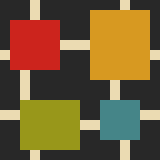
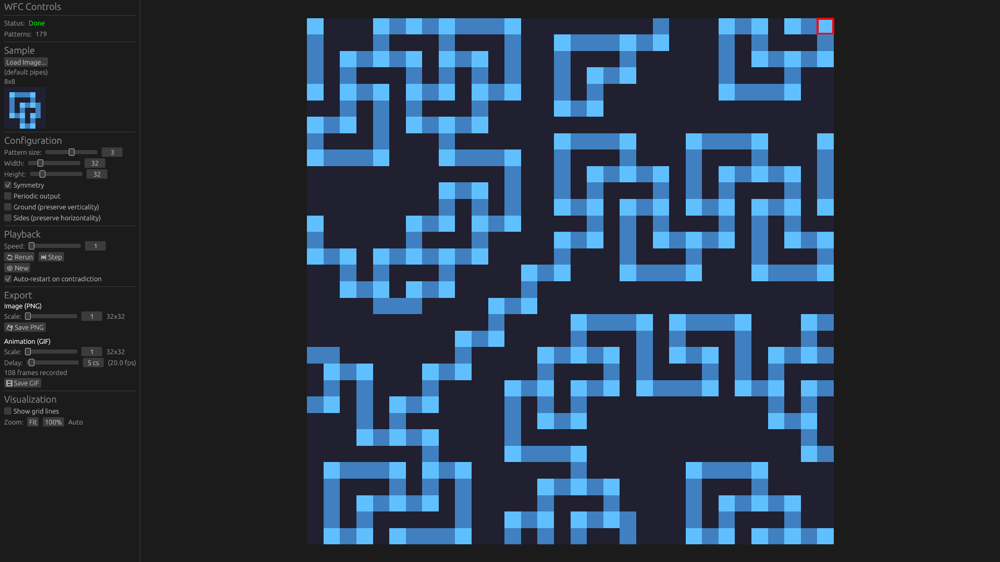
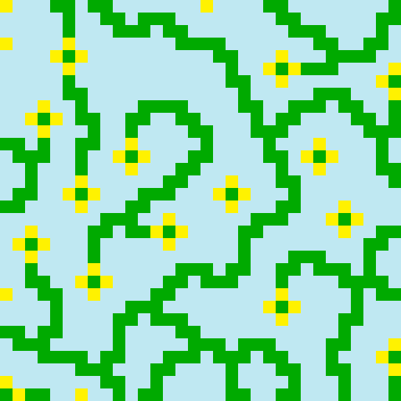
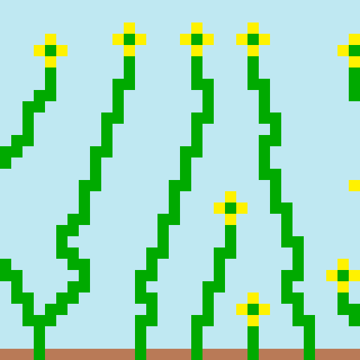
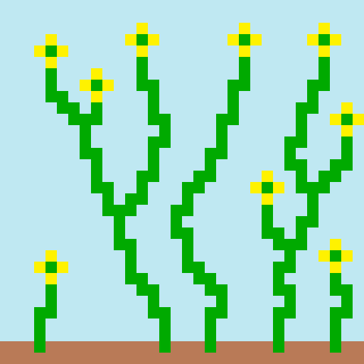
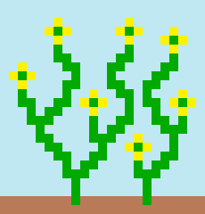

# Wave Function Collapse (WFC)

Wave Function Collapse overlapping model implementation in Rust. Generates novel images by extracting NxN patterns from samples and synthesizing outputs that follow the same adjacency constraints.

<p align="center">
<<<<<<< HEAD
  
  
=======
  
  
>>>>>>> c16d3e8 (docs: add README and MIT license)
</p>

## Algorithm

The overlapping model extracts all NxN pattern tiles from a sample
image and records which patterns can appear adjacent to each other.
Starting from a completely undetermined output, it iteratively:

1. Finds the cell with lowest entropy (fewest possible patterns)
2. Collapses it to a random valid pattern
3. Propagates constraints to neighboring cells
4. Repeats until complete or a contradiction occurs

## GUI

```bash
cargo run --release --bin wfc-egui
```



## Results

<p align="center">
<<<<<<< HEAD
  
  
=======
  
  
>>>>>>> c16d3e8 (docs: add README and MIT license)
</p>

### Edge Constraints

Let's see how edge constraints affect the output.

**Sample:**

<p align="center">
<<<<<<< HEAD
  
</p>

**Results:**

<p align="center">
  
  
  
</p>

**Left to right:** Without constraints, with vertical constraints, with vertical and sides constraints
=======
  
</p>

|              Without constraints              |                Vertical constraints                |               Vertical + Sides constraints               |
| :-------------------------------------------: | :------------------------------------------------: | :------------------------------------------------------: |
|  |  |  |
>>>>>>> c16d3e8 (docs: add README and MIT license)

## License

MIT
